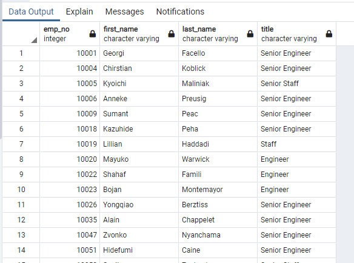
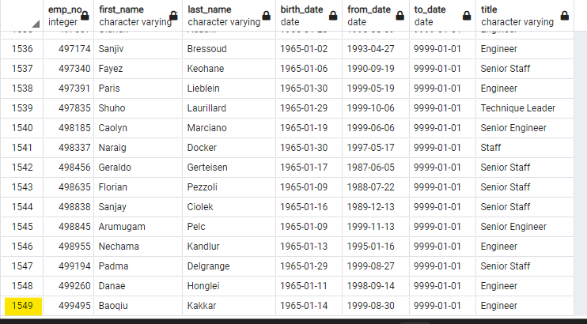

# Pewlett_Hackard_Analysis
## Deliverable 1: The Number of Retiring Employees 
A query was written and executed to create a Retirement Titles table for employees who are born between January 1, 1952 and December 31, 1955.

The Retirement Titles table was exported.

A query was written and executed to create a Unique Titles table that contains the employee number, first and last name, and most recent title.

The Unique Titles table was exported.

A query was written and executed to create a Retiring Titles table that contains the number of titles filled by employees who are retiring.

The Retiring Titles table was exported.

## Deliverable 2: The Employees Eligible for the Mentorship Program

A query was written and executed to create a Mentorship Eligibility table for current employees who were born between January 1, 1965 and December 31, 1965.

The Mentorship Eligibility table was exported and saved.

## Deliverable 3: A written report on the employee database analysis

### Overview of the analysis:
The purpose of this analysis was to determine the number of retiring employees at Pewlett Hackard per title, and identify employees who are eligible to participate in a mentorship program. This is to plan and prepare for the the “silver tsunami”, a term used to refer to the amount of current employees reaching retirement age. By finding out how many employees are ready to retire, they hope to to prepare by implementing a mentoring program.  The mentoring program would allow experienced and successful employees to step back into a part-time role instead of retiring completely. Their new role in the company would be as a mentor to the newly hired folks. 

### Results: 
Four major points from the two analysis deliverables are as follows:

- The amount of people nearing retirement is 72,458.

  - 
  
 - The amount of people eligible for the mentor program is 1,549.
 
  - 
 
 - The amount of jobs that would need to be replaced and mentored outnumbers the amount of possible mentors available by 70,909.
 
 - The majority of those retiring are Senior Engineers and Senior Staff, totaling 50,842.
 

### Summary: 

We found that 72,458 roles will need to be replaced as the “silver tsunami” begins to make impact. With only 1,549 employees that
currenlty qualify as mentors, this will out number the amount leaving by 70,909.  It does not seemt that there will be enough retirement-ready employees in the departments to mentor the next generation of Pewlett Hackard employees.

More insight may be gained by doing additional queries by department and salaries to see which areas will be most affected and which would have the most economic impact.

